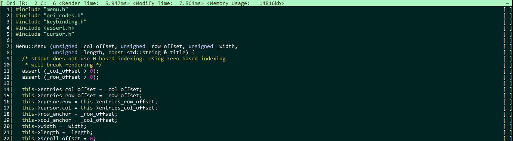
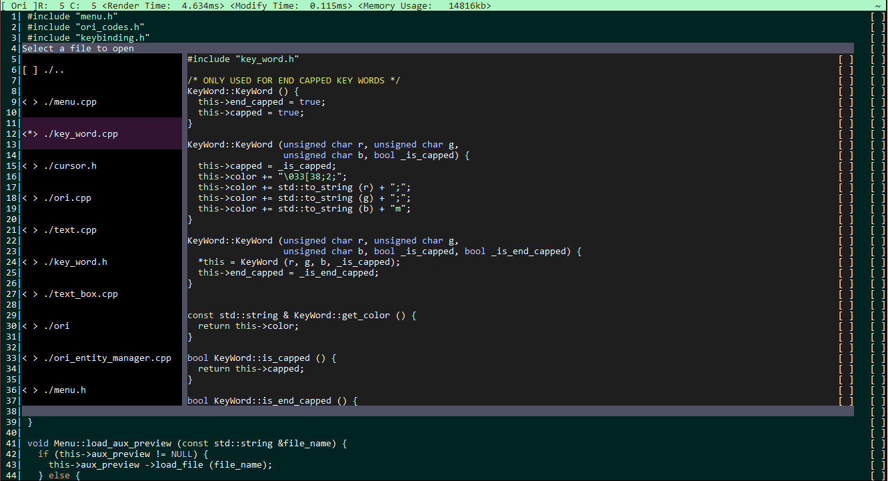
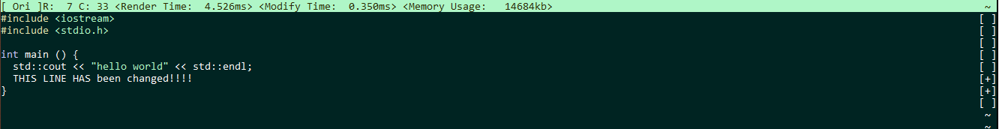

# Ori

An in-terminal text editor made entirely with the C++ standard library.
Inspired by other in-terminal text editors such as Vim and Nano.





## Features
* Syntax highlighting for C/C++ files.
* Undo functionality.
* Built-in file explorer; used to switch between files. Provides a file preview before opening.
* Changed lines are marked with a plus to keep track of changes.



## Build
A makefile is provided to build ori; ori has only been tested on Linux.
```bash
make
```

## Usage
The makefile will create an executable named "ori". Simply invoke it to launch.
```bash
$ ./ori
```

## Controls

* **CTRL + O**: Opens a file explorer, you may select directories or a file to open in Ori.
* **PGUP/PGDOWN**: Scroll up or down respectively. While in the file explorer; scrolls the file preview up or down.
* **CTRL + L**: Toggles line numbers
* **CTRL + H**: Toggles C/C++ syntax highlighting
* **CTRL + U**: Undo last edit
* **CTRL + W**: Save contents of current file
* **ESC 2X**  : Quit Ori


